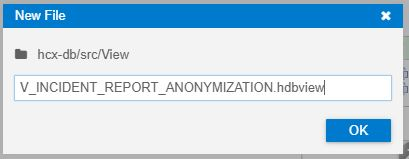
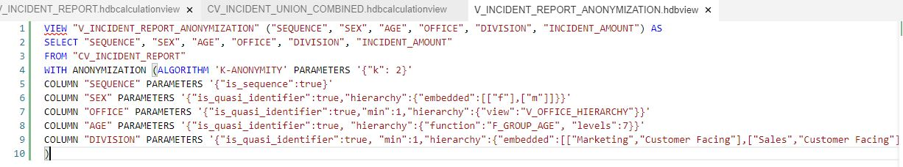

# Chapter 1: Anonymize the Incident Report

< [Back to Exercise 3](./README.md)

## Create a new View

1. Create a **New File** under the **View** folder and name it: ``V_INCIDENT_REPORT_ANONYMIZATION.hdbview``

   

2. Paste the code into the created file:
   ```
   VIEW "V_INCIDENT_REPORT_ANONYMIZATION" ("SEQUENCE", "SEX", "AGE", "OFFICE", "DIVISION", "INCIDENT_AMOUNT") AS
   SELECT "SEQUENCE", "SEX", "AGE", "OFFICE", "DIVISION", "INCIDENT_AMOUNT" 
   FROM "CV_INCIDENT_REPORT"  
   WITH ANONYMIZATION (ALGORITHM 'K-ANONYMITY' PARAMETERS '{"k": 2}' 
   COLUMN "SEQUENCE" PARAMETERS '{"is_sequence":true}' 
   COLUMN "SEX" PARAMETERS '{"is_quasi_identifier":true,"hierarchy":{"embedded":[["f"],["m"]]}}' 
   COLUMN "OFFICE" PARAMETERS '{"is_quasi_identifier":true,"min":1,"hierarchy":{"view":"V_OFFICE_HIERARCHY"}}' 
   COLUMN "AGE" PARAMETERS '{"is_quasi_identifier":true, "hierarchy":{"function":"F_GROUP_AGE", "levels":7}}' 
   COLUMN "DIVISION" PARAMETERS '{"is_quasi_identifier":true, "min":1,"hierarchy":{"embedded":[["Marketing","Customer Facing"],["Sales","Customer Facing"],["Development","Non Customer Facing"],["Research","Non Customer Facing"]]}}' 
   ) 
   ```
   It should look like this. 
   
   
   
   
## Deploy to HANA Cloud

**Deploy** the created view to HANA by clicking on the **rocket symbol**.

[Go to Chapter 2](./Exercise3_Chapter2.md) >
