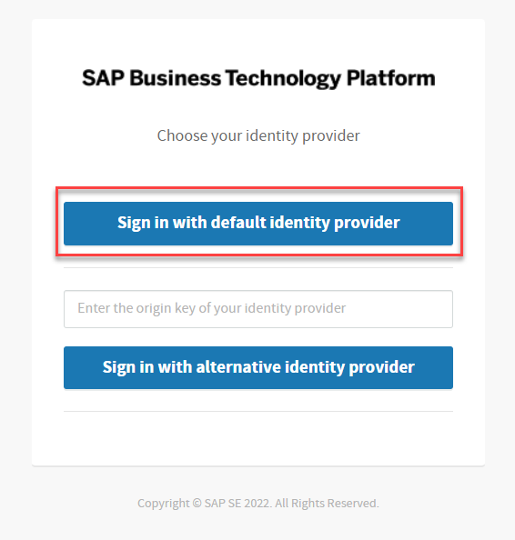
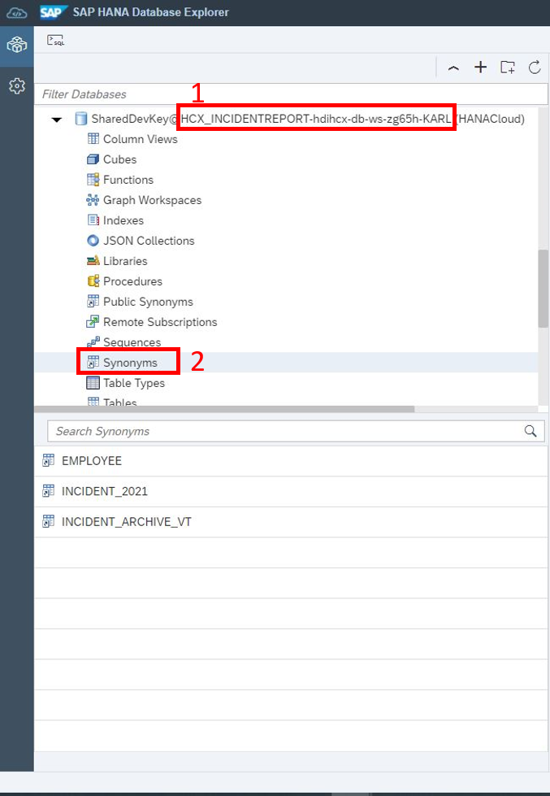
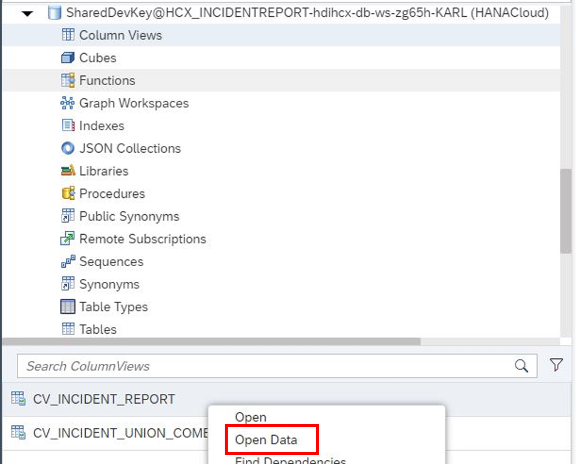
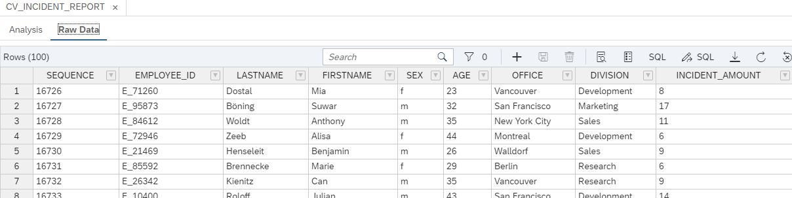
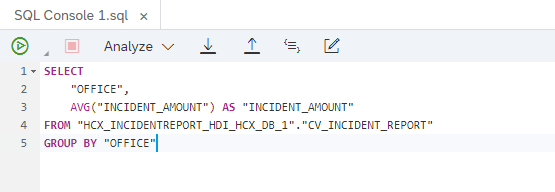
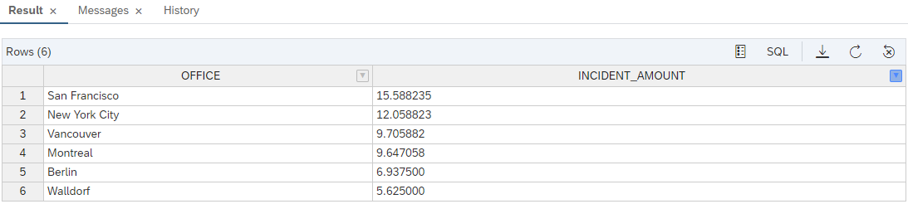

# Chapter 2: Explore the Anonymized Report

< [Back to Chapter 1](./Exercise3_Chapter1.md)

## Open HDI Container in the SAP HANA Database Explorer

To view your deployed database objects in SAP HANA Cloud, click on **Open HDI container** next to the rocket.

## Database Explorer

Click on **Sign in with default identity provider** and paste the platform Username ``platformEA1811`` and the password `Welcomek9cG0` and click on **Next**.

The Database Explorer opens, in which you can see all the HANA objects currently available in your HDI container. As you can see from the database's name, you are currently within your recently created HDI container. Click on **Synonyms** to see the tables you are accessing through the user-provided service (which you created in Exercise 1).

## Explore table data

Right-Click on the **INCIDENT_ARCHIVE_VT_SYN** object and select **Open Data** to get an overview about the incidents, that happened in 2020 and are stored in the data lake. 

To explore all tables, proceede in the same way with the other synonym objects.

## Preview the raw data

Select **Column Views** and right-click on **CV_INCIDENT_REPORT**. Click on **Open Data** to see the Incident Report with all its details. 

    

    
Since the data you see is sensitive, we will have anonymized the data so further business users can work with it and get insights.

## Find some insights

Now it's your turn to find out some insights of the created report. 

1) Right-click on **CV_INCIDENT_REPORT** and select **Generate SELECT Statement**.
2) Leave the SEQUENCE and the identifier columns (EMPLOYEE_ID, LASTNAME, FIRSTNAME) out of the statement to find some groups which are opening more tickets than others. The image below shows you an example.

   
   
   This results into the following.
   
   
   
   You can see that different office locations result in different incidents per employee. You can exchange the office column to other quasi-identifiers to check if they provide also different incidents per employee.

## Preview the anonymized report

1. Select **Views** in the catalog and right-click on **V_INCIDENT_REPORT_ANONYMIZATION**. Select the **Generate SELECT Statement**. This opens a SQL Console with the statement.

   

2. Before you can run the select statement, you need to **refresh** your View. To do so, **paste** the following code ``REFRESH VIEW XXXXXXXXXXXXXXXXXX ANONYMIZATION;`` into the console and above the previously generated statement. Please **copy** and **paste** the highlighted name from your select statement into the XXX area of the refresh View statement. 

   
   
   Click on the **green** **Play button** to execute both commands.

## Explore the report and gain first Insights

Explore the anonymized report. You will see that there is no way to identify a person through the given quasi-identifiers. 

Maybe you can find a group of employees opening more incidents than others by setting some group by clauses. 

**Congratulations! You finished the Hands-On Exercises.**

< [Back to start](./README.md)

< [Back to Hands-On Overview](../README.md)
